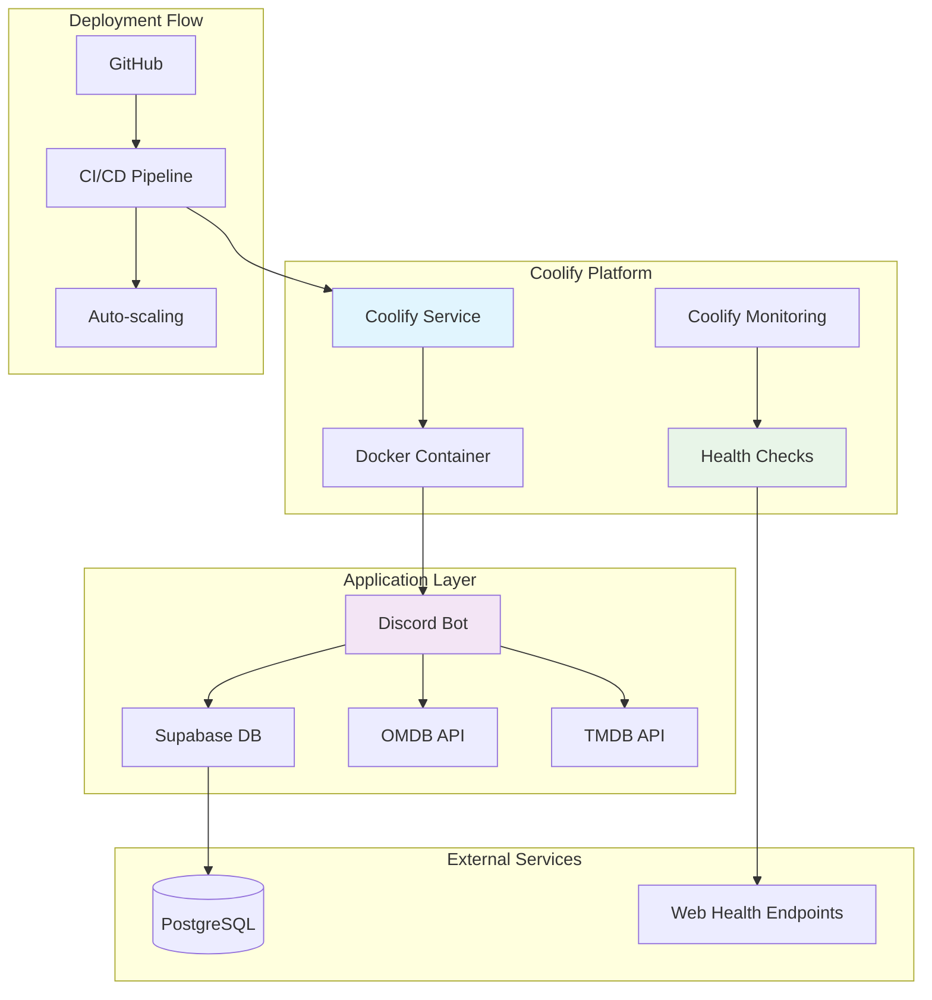

# 🚀 Python IMDb Bot - Coolify Production Deployment Guide

A comprehensive guide to optimize and deploy your Python Discord bot to production using Coolify with best practices for performance, security, and monitoring.

## 📋 Table of Contents

- [Prerequisites](#prerequisites)
- [Architecture Overview](#architecture-overview)
- [Docker Optimization](#docker-optimization)
- [Coolify Configuration](#coolify-configuration)
- [Environment Variables & Secrets](#environment-variables--secrets)
- [Performance Optimizations](#performance-optimizations)
- [Security Enhancements](#security-enhancements)
- [Deployment Strategies](#deployment-strategies)
- [Monitoring & Observability](#monitoring--observability)
- [CI/CD Integration](#cicd-integration)
- [Code Modifications](#code-modifications)
- [Troubleshooting](#troubleshooting)
- [Maintenance](#maintenance)

## 🎯 Prerequisites

- Coolify instance (self-hosted or cloud)
- Discord Bot Token with required permissions
- Supabase project and database
- OMDB API key (optional)
- GitHub repository for CI/CD

### Required Discord Bot Permissions

```json
{
  "permissions": [
    "Read Messages",
    "Send Messages",
    "Read Message History",
    "Add Reactions",
    "Manage Messages",
    "Use Slash Commands"
  ],
  "intents": [
    "Message Content Intent",
    "Server Members Intent",
    "Presence Intent"
  ]
}
```

## 🏗️ Architecture Overview



## 🐳 Docker Optimization

Your Dockerfile has been optimized for Coolify deployment with the following enhancements:

### Key Optimizations

1. **Multi-stage Build**: Separate builder and runtime stages for minimal image size
2. **Dependency Management**: Using `uv` for fast, reliable Python package installation
3. **Security**: Non-root user execution
4. **Health Checks**: HTTP-based health checks for Coolify monitoring
5. **Build Caching**: Optimized layer caching for faster builds
6. **Metadata Labels**: OCI and Coolify-specific labels

### Coolify-Specific Labels

```dockerfile
LABEL coolify.service.type="background" \
      coolify.service.healthcheck="http://localhost:8080/health" \
      coolify.service.restart="unless-stopped"
```

### Build Optimization Tips

- **Layer Caching**: Copy dependency files first to leverage Docker layer caching
- **Minimal Base Image**: Using `python:3.12-slim` for smaller footprint
- **Build Args**: Support for dynamic versioning and metadata

## ⚙️ Coolify Configuration

### 1. Service Setup

```yaml
# Coolify Service Configuration
service:
  name: python-imdb-bot
  type: background
  source:
    type: github
    repository: your-username/python-imdb-bot
    branch: main
  build:
    type: dockerfile
    dockerfile_path: ./Dockerfile
  ports:
    - "8080:8080"  # Health check port
  environment:
    - key: NODE_ENV
      value: production
```

### 2. Resource Allocation

```yaml
resources:
  limits:
    cpus: "0.5"
    memory: 512MB
  reservations:
    cpus: "0.25"
    memory: 256MB
```

### 3. Health Check Configuration

```yaml
healthcheck:
  enabled: true
  path: /health
  port: 8080
  interval: 30s
  timeout: 10s
  retries: 3
  start_period: 60s
```

## 🔐 Environment Variables & Secrets

### Coolify Environment Variables

Set these in your Coolify service configuration:

| Variable | Required | Description |
|----------|----------|-------------|
| `DISCORD_TOKEN` | ✅ | Discord bot token |
| `SUPABASE_URL` | ✅ | Supabase project URL |
| `SUPABASE_KEY` | ✅ | Supabase anon key |
| `LOG_LEVEL` | ❌ | Logging level (INFO) |
| `LOG_FILE` | ❌ | Log file path (/app/logs/bot.log) |
| `OMDB_API_KEY` | ❌ | OMDB API key |
| `TMDB_API_KEY` | ❌ | TMDB API key |
| `CHANNEL_ID` | ❌ | Default Discord channel ID |

### Secret Management

```yaml
# Coolify Secrets Configuration
secrets:
  - name: DISCORD_TOKEN
    type: secret
    value: your_discord_bot_token_here
  - name: SUPABASE_KEY
    type: secret
    value: your_supabase_anon_key
```

### Environment File Migration

If migrating from `.env` files:

```bash
# Remove .env from repository
git rm --cached .env
echo ".env" >> .gitignore

# Set variables in Coolify dashboard instead
```

## ⚡ Performance Optimizations

### Database Optimization

1. **Connection Pooling**:
```python
# In your database configuration
from supabase import create_client, Client

supabase: Client = create_client(
    supabase_url,
    supabase_key,
    options={
        "pool": {
            "min": 2,
            "max": 10
        }
    }
)
```

2. **Database Indexes**:
```sql
-- Add indexes for frequently queried columns
CREATE INDEX idx_ratings_movie_user ON ratings(movie_id, user_id);
CREATE INDEX idx_movies_imdb_id ON movies(imdb_id);
CREATE INDEX idx_ratings_created_at ON ratings(created_at);
```

3. **Query Optimization**:
```python
# Use select with specific columns
result = supabase.table('ratings').select('id,user_id,movie_id,rating').execute()

# Use pagination for large datasets
result = supabase.table('movies').select('*').range(0, 49).execute()
```

### Caching Strategy

1. **In-Memory Caching**:
```python
from cachetools import TTLCache
import asyncio

# Global cache for rating statistics
rating_cache = TTLCache(maxsize=1000, ttl=300)  # 5-minute TTL

async def get_cached_rating_stats(movie_id: str):
    if movie_id in rating_cache:
        return rating_cache[movie_id]

    # Fetch from database
    stats = await fetch_rating_stats(movie_id)
    rating_cache[movie_id] = stats
    return stats
```

2. **Redis Integration** (Optional):
```python
import redis.asyncio as redis

redis_client = redis.Redis(
    host=os.getenv('REDIS_HOST', 'localhost'),
    port=int(os.getenv('REDIS_PORT', 6379)),
    decode_responses=True
)

async def cache_movie_data(movie_id: str, data: dict):
    await redis_client.setex(f"movie:{movie_id}", 3600, json.dumps(data))
```

### Build Time Optimization

1. **Dependency Caching**:
```dockerfile
# Copy dependency files first for better caching
COPY pyproject.toml uv.lock ./
RUN uv sync --frozen --no-install-project --no-dev
```

2. **Parallel Builds**: Coolify supports parallel builds for faster deployment

### Memory Optimization

```python
# Use __slots__ for memory-efficient classes
class MovieData:
    __slots__ = ['imdb_id', 'title', 'year', 'poster', 'plot']

    def __init__(self, imdb_id, title, year, poster, plot):
        self.imdb_id = imdb_id
        self.title = title
        self.year = year
        self.poster = poster
        self.plot = plot
```

## 🛡️ Security Enhancements

### Docker Security

```dockerfile
# Security best practices
FROM python:3.12-slim

# Non-root user
RUN groupadd --gid 1000 botuser && \
    useradd --uid 1000 --gid botuser --shell /bin/bash --create-home botuser

USER botuser

# Read-only filesystem where possible
VOLUME ["/app/logs"]
```

### Network Security

1. **Internal Networking**:
```yaml
# Coolify network configuration
networks:
  - name: internal
    driver: bridge
    internal: true
```

2. **Firewall Rules**:
- Allow Discord API access (outbound)
- Allow Supabase access (outbound)
- Restrict health check port to internal network

### Secret Management

```yaml
# Coolify secrets configuration
secrets:
  - name: DISCORD_TOKEN
    type: environment
    value: ${DISCORD_TOKEN}
  - name: SUPABASE_KEY
    type: environment
    value: ${SUPABASE_KEY}
```

### SSL/TLS Configuration

For health check endpoints:

```python
# Enable HTTPS for health endpoints if needed
from fastapi import FastAPI
from fastapi.middleware.httpsredirect import HTTPSRedirectMiddleware

app = FastAPI()
app.add_middleware(HTTPSRedirectMiddleware)
```

## 🚀 Deployment Strategies

### Single Instance Deployment

```yaml
# Coolify service configuration
service:
  name: imdb-bot
  replicas: 1
  strategy: recreate
  restart: unless-stopped
```

### Horizontal Scaling

```yaml
# For high-traffic scenarios
service:
  name: imdb-bot
  replicas: 3
  strategy: rolling-update
  restart: unless-stopped

# Load balancer configuration
load_balancer:
  enabled: true
  ports:
    - "8080:8080"
  health_check:
    path: /health
    interval: 30s
```

### Blue-Green Deployment

```yaml
# Coolify blue-green configuration
deployment:
  strategy: blue-green
  readiness_probe:
    path: /ready
    port: 8080
  liveness_probe:
    path: /health
    port: 8080
```

### Database Migration Strategy

```bash
# Pre-deployment migration
version: '3.8'
services:
  migrate:
    image: your-registry/imdb-bot:latest
    command: python -m src.python_imdb_bot.migrate
    environment:
      - SUPABASE_URL=${SUPABASE_URL}
      - SUPABASE_KEY=${SUPABASE_KEY}
    depends_on:
      - db
```

## 📊 Monitoring & Observability

### Health Endpoints

Your bot exposes three health check endpoints:

```python
@app.get("/health")
async def health_check():
    return {
        "status": "healthy",
        "timestamp": datetime.utcnow().isoformat(),
        "uptime_seconds": time.time() - start_time
    }

@app.get("/ready")
async def readiness_check():
    # Check database connectivity
    try:
        result = supabase.table('settings').select('*').limit(1).execute()
        return {
            "status": "ready",
            "database": "connected",
            "timestamp": datetime.utcnow().isoformat()
        }
    except Exception as e:
        raise HTTPException(status_code=503, detail="Database not ready")

@app.get("/metrics")
async def metrics():
    return {
        "guilds_configured": len(bot.guilds),
        "movies_tracked": await get_movie_count(),
        "ratings_total": await get_rating_count(),
        "timestamp": datetime.utcnow().isoformat()
    }
```

### Coolify Monitoring Integration

```yaml
# Coolify monitoring configuration
monitoring:
  enabled: true
  prometheus:
    enabled: true
    path: /metrics
  grafana:
    enabled: true
    dashboards:
      - name: bot-performance
        source: https://grafana.com/dashboards/...
```

### Logging Configuration

```python
# Structured logging for better observability
import structlog

logger = structlog.get_logger()

# Log important events
logger.info("bot_started", guilds=len(bot.guilds))
logger.error("api_error", error=str(e), endpoint="omdb")
```

### Alert Configuration

```yaml
# Coolify alert rules
alerts:
  - name: bot_unhealthy
    condition: health_check_failed
    threshold: 3
    time_window: 5m
    channels: [discord, email]

  - name: high_memory_usage
    condition: memory_usage > 80%
    threshold: 80
    time_window: 5m
    channels: [discord]
```

## 🔄 CI/CD Integration

### GitHub Actions Workflow

```yaml
# .github/workflows/deploy.yml
name: Deploy to Coolify

on:
  push:
    branches: [main]
  pull_request:
    branches: [main]

jobs:
  test:
    runs-on: ubuntu-latest
    steps:
      - uses: actions/checkout@v4
      - name: Set up Python
        uses: actions/setup-python@v4
        with:
          python-version: '3.12'
      - name: Install dependencies
        run: |
          pip install uv
          uv sync
      - name: Run tests
        run: uv run pytest

  deploy:
    needs: test
    runs-on: ubuntu-latest
    if: github.ref == 'refs/heads/main'
    steps:
      - name: Deploy to Coolify
        uses: coolify/deploy-action@v1
        with:
          api_token: ${{ secrets.COOLIFY_API_TOKEN }}
          server: ${{ secrets.COOLIFY_SERVER }}
          project: python-imdb-bot
          service: imdb-bot
```

### Coolify Webhook Integration

```yaml
# Coolify webhook configuration
webhooks:
  - url: https://hooks.slack.com/services/...
    events: [deployment_success, deployment_failed]
  - url: https://discord.com/api/webhooks/...
    events: [health_check_failed]
```

## 🔧 Code Modifications

### Graceful Shutdown

```python
import asyncio
import signal

async def shutdown_handler():
    """Handle graceful shutdown"""
    logger.info("shutdown_initiated")

    # Close database connections
    await supabase.close()

    # Close Discord connection
    await bot.close()

    logger.info("shutdown_complete")

# Register signal handlers
for sig in (signal.SIGTERM, signal.SIGINT):
    asyncio.get_event_loop().add_signal_handler(
        sig, lambda: asyncio.create_task(shutdown_handler())
    )
```

### Configuration Management

```python
# Use Pydantic settings for better configuration
from pydantic_settings import BaseSettings

class BotSettings(BaseSettings):
    discord_token: str
    supabase_url: str
    supabase_key: str
    log_level: str = "INFO"
    omdb_api_key: Optional[str] = None

    class Config:
        env_file = ".env"
        case_sensitive = False

settings = BotSettings()
```

### Error Handling Enhancement

```python
# Global error handler
@bot.event
async def on_error(event, *args, **kwargs):
    logger.error(
        "discord_error",
        event=event,
        args=args,
        kwargs=kwargs,
        exc_info=True
    )

# API error handling
async def safe_api_call(func, *args, **kwargs):
    try:
        return await func(*args, **kwargs)
    except Exception as e:
        logger.error("api_call_failed", error=str(e), func=func.__name__)
        return None
```

## 🔍 Troubleshooting

### Common Coolify Deployment Issues

#### 1. Build Failures

**Symptoms**: Docker build fails with dependency errors

**Solutions**:
```bash
# Check build logs in Coolify
# Verify Python version compatibility
# Update uv.lock file
uv lock --upgrade
```

#### 2. Health Check Failures

**Symptoms**: Service shows as unhealthy

**Debug**:
```bash
# Test health endpoint manually
curl -f http://localhost:8080/health

# Check bot logs
docker logs <container_id>

# Verify environment variables
docker exec <container_id> env
```

#### 3. Database Connection Issues

**Symptoms**: Bot can't connect to Supabase

**Solutions**:
```python
# Test connection in code
import asyncio
from supabase import create_client

async def test_connection():
    supabase = create_client(url, key)
    result = supabase.table('settings').select('*').limit(1).execute()
    print("Connection successful" if result.data else "Connection failed")
```

#### 4. Memory Issues

**Symptoms**: Container crashes with OOM errors

**Solutions**:
```yaml
# Increase memory limits in Coolify
resources:
  limits:
    memory: 1GB
  reservations:
    memory: 512MB

# Optimize memory usage in code
# Use streaming for large data
# Implement connection pooling
```

#### 5. Permission Issues

**Symptoms**: Bot can't write logs or access files

**Solutions**:
```dockerfile
# Fix permissions in Dockerfile
RUN mkdir -p /app/logs && chown -R botuser:botuser /app
USER botuser
```

### Debugging Commands

```bash
# View Coolify service logs
coolify logs <service-id>

# Check container resource usage
docker stats <container_id>

# Test database connectivity
docker exec <container_id> python -c "
from src.python_imdb_bot.utils import supabase
result = supabase.table('settings').select('*').limit(1).execute()
print('DB connected' if result.data else 'DB failed')
"

# Verify Discord connectivity
docker exec <container_id> python -c "
import discord
print('Discord.py version:', discord.__version__)
"
```

## 🛠️ Maintenance

### Regular Tasks

1. **Update Dependencies**:
```bash
# Update Python dependencies
uv lock --upgrade

# Update Docker base images
docker pull python:3.12-slim
```

2. **Database Maintenance**:
```sql
-- Vacuum and analyze for performance
VACUUM ANALYZE ratings;
VACUUM ANALYZE movies;

-- Monitor index usage
SELECT * FROM pg_stat_user_indexes WHERE schemaname = 'public';
```

3. **Log Rotation**:
```yaml
# Coolify log configuration
logging:
  driver: json-file
  options:
    max-size: 10m
    max-file: "3"
```

### Backup Strategy

```yaml
# Coolify backup configuration
backups:
  - name: database
    type: postgresql
    schedule: "0 2 * * *"  # Daily at 2 AM
    retention: 7

  - name: logs
    type: filesystem
    source: /app/logs
    schedule: "0 3 * * *"  # Daily at 3 AM
    retention: 30
```

### Performance Monitoring

```python
# Performance monitoring
import time
import psutil

def get_system_stats():
    return {
        "cpu_percent": psutil.cpu_percent(),
        "memory_percent": psutil.virtual_memory().percent,
        "disk_usage": psutil.disk_usage('/').percent,
        "uptime": time.time() - psutil.boot_time()
    }
```

## 📚 Additional Resources

- [Coolify Documentation](https://coolify.io/docs)
- [Docker Best Practices](https://docs.docker.com/develop/dev-best-practices/)
- [Discord.py Documentation](https://discordpy.readthedocs.io/)
- [Supabase Documentation](https://supabase.com/docs)

---

## 🎉 Deployment Checklist

- [ ] Coolify instance configured
- [ ] Discord bot token obtained
- [ ] Supabase project created
- [ ] Environment variables set in Coolify
- [ ] Secrets configured
- [ ] Resource limits set
- [ ] Health checks configured
- [ ] CI/CD pipeline set up
- [ ] Monitoring enabled
- [ ] Backup strategy implemented
- [ ] Test deployment completed
- [ ] Go-live checklist reviewed

This guide provides a comprehensive approach to deploying your Python IMDb bot to production using Coolify with industry best practices for performance, security, and maintainability.